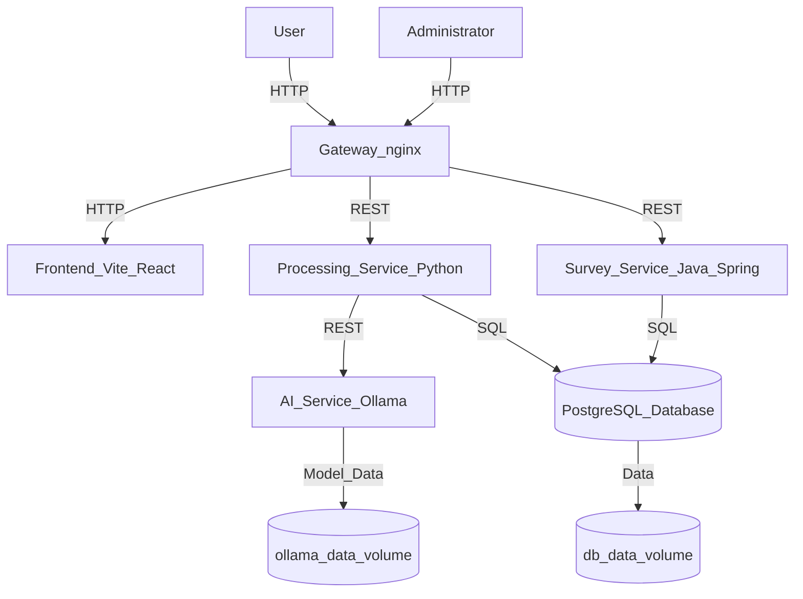

# 🧠 formul.ai

**Code of forms. Powered by AI. Open source project.**

formul.ai is a platform for building and analyzing dynamic forms powered by local AI models. Users can create surveys with conditional logic, collect responses, and provide instant analysis of AI-driven responses — all with full data privacy.

## ✨ Features

- Dynamic forms that adapt to user input
- Local AI-based analysis and instant analysis of collected form's responses 
- Admin panel for managing forms and results
- Full control over data privacy (on-premise processing)

## 👥 Roles

- **Administrators**: manage forms and results
- **Respondents**: fill out forms and receive feedback

## 🛠️ Required Tools

To run this project, you need:

- [Docker](https://www.docker.com/) and Docker Compose
- [Git](https://git-scm.com/)

## 🚀 Quick Start

1. **Clone the repository:**
   ```bash
   git clone https://github.com/opendexcom/formul.ai.git
   cd formul.ai
   ```

2. **Configure environment:**
   ```bash
   cp .env.example .env
   # Edit .env as needed
   ```
   > **Tip:** If you want to develop services directly on your host machine (not in Docker), use the `.env.host-develop` file.  
   > This configures connections to local PostgreSQL, Ollama, etc.

   **To check out the `develop` branch from the remote repository:**
   ```bash
   git fetch origin
   git checkout develop
   # If the branch does not exist locally, use:
   # git checkout -b develop origin/develop
   ```

3. **Run with Docker Compose:**
   ```bash
   docker-compose up -d
   # Or to rebuild:
   docker-compose up --build -d
   ```

The app will be available at [http://localhost](http://localhost).

## 📚 Documentation

- [Technology Stack & Tools](./docs/technology.md)
- [Privacy & Security](./docs/privacy.md)
- [Troubleshooting](./docs/troubleshooting.md)
- [Continuous Integration](./docs/ci.md)
- [Contributing](./docs/contributing.md)

## 🐳 Docker Architecture

Below is a high-level and container-level architecture diagram for the Dockerized Formul.ai platform:



**Description:**  
- Users and administrators access the system via the nginx gateway.
- nginx routes requests to the frontend, processing, and survey containers.
- The processing service communicates with the AI (Ollama) and the PostgreSQL database.
- Data and models are persisted in Docker volumes.

## 📜 License

Licensed under the **GNU AGPL-3.0**. See [LICENSE](./LICENSE).

## 📁 Repository

GitHub: [opendexcom/formul.ai](https://github.com/opendexcom/formul.ai)

---

_See [docs/](./docs/) for more details._
