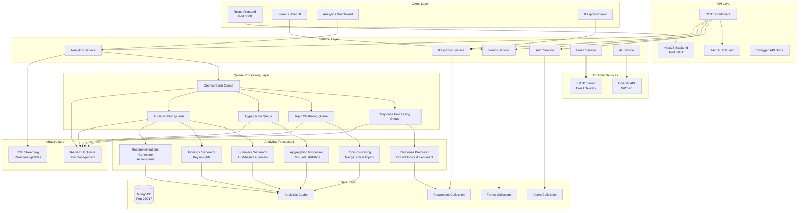

# FormulAI System Architecture

## Architecture Overview

FormulAI is a modern full-stack application built with a clean separation of concerns, following microservices patterns with queue-based processing for scalability and reliability.

## System Architecture Diagram



## Layered Architecture (Pyramid)

```
                    ┌─────────────────────┐
                    │   Client Layer      │
                    │  React 19 + Vite    │
                    │  Tailwind CSS       │
                    └─────────────────────┘
                            │
                    ┌─────────────────────┐
                    │   API Gateway       │
                    │  NestJS REST API    │
                    │  JWT Authentication │
                    │  Swagger Docs       │
                    └─────────────────────┘
                            │
            ┌───────────────┼───────────────┐
            │               │               │
    ┌───────────────┐ ┌────────────┐ ┌────────────┐
    │ Form Service  │ │ Auth       │ │ Response   │
    │               │ │ Service    │ │ Service    │
    └───────────────┘ └────────────┘ └────────────┘
            │
    ┌───────────────────────────────────────────────┐
    │        Analytics Orchestration Layer          │
    │  Queue-based parallel processing with Redis   │
    └───────────────────────────────────────────────┘
            │
    ┌───────┴───────────────────────────────┐
    │                                       │
┌───────────────┐                   ┌──────────────┐
│ Processing    │                   │ AI Generation│
│ Queues        │                   │ Queues       │
│ - Response    │                   │ - Summary    │
│ - Clustering  │                   │ - Findings   │
│ - Aggregation │                   │ - Recommends │
└───────────────┘                   └──────────────┘
            │                               │
            └───────────────┬───────────────┘
                            │
                    ┌───────────────┐
                    │  AI Service   │
                    │  OpenAI GPT-4 │
                    └───────────────┘
                            │
                    ┌───────────────┐
                    │  Data Layer   │
                    │   MongoDB     │
                    │  - Forms      │
                    │  - Responses  │
                    │  - Analytics  │
                    └───────────────┘
```

## Component Breakdown

### 1. Client Layer (Frontend)
**Technology**: React 19, TypeScript, Vite, Tailwind CSS

**Components**:
- **Form Builder**: Drag-and-drop interface for creating forms
- **Analytics Dashboard**: 13 interactive cards displaying insights
- **Response Management**: Real-time tracking and filtering
- **Authentication**: JWT-based secure login

**Key Files**:
- `client/src/pages/FormEditor.tsx` - Form builder UI
- `client/src/pages/FormAnalytics.tsx` - Analytics dashboard
- `client/src/components/analytics/` - Analytics visualization components
- `client/src/services/formsService.ts` - API client

### 2. API Layer (Backend)
**Technology**: NestJS, TypeScript, Express

**Controllers**:
- `FormsController` - CRUD operations for forms
- `AuthController` - User authentication
- `ResponseController` - Response submission and retrieval

**Guards & Middleware**:
- JWT Authentication Guard
- Request validation
- Error handling
- Logging middleware

**Key Files**:
- `server/src/forms/forms.controller.ts`
- `server/src/auth/jwt-auth.guard.ts`
- `server/src/main.ts` - Application bootstrap

### 3. Service Layer
**Business Logic & Orchestration**

**Core Services**:
- **FormsService**: Form CRUD, validation, ownership
- **AnalyticsService**: Analytics retrieval and caching
- **ResponseService**: Response processing and storage
- **AIService**: OpenAI API integration
- **EmailService**: Invitation and notification emails

**Key Files**:
- `server/src/forms/forms.service.ts`
- `server/src/analytics/analytics.service.ts`
- `server/src/ai/ai.service.ts`

### 4. Queue Processing Layer
**Technology**: Bull (Redis-backed job queues)

**Queue Architecture**:
```
Orchestration Queue (Master)
    ├── Response Processing Queue (Workers)
    ├── Topic Clustering Queue (Workers)
    ├── Aggregation Queue (Workers)
    └── AI Generation Queue (Workers)
```

**Queue Responsibilities**:

1. **Orchestration Queue**: 
   - Coordinates entire analytics pipeline
   - Manages workflow stages
   - Publishes SSE progress updates

2. **Response Processing Queue**:
   - Batch processes responses (20 per job)
   - Extracts topics and sentiment per response
   - Uses AI for thematic coding

3. **Topic Clustering Queue**:
   - Merges similar topics into canonical themes
   - Reduces 50+ raw topics to 8-15 clusters
   - Semantic similarity matching

4. **Aggregation Queue**:
   - Calculates topic frequencies and distributions
   - Computes sentiment statistics
   - Generates co-occurrence matrices

5. **AI Generation Queue**:
   - Three parallel jobs: Summary, Findings, Recommendations
   - LLM-based executive summary
   - Evidence-based key findings
   - Prioritized recommendations

**Key Files**:
- `server/src/analytics/queues/orchestration.consumer.ts`
- `server/src/analytics/queues/response-processing.consumer.ts`
- `server/src/analytics/queues/topic-clustering.consumer.ts`
- `server/src/analytics/queues/aggregation.consumer.ts`
- `server/src/analytics/queues/ai-generation.consumer.ts`

### 5. Analytics Processors

**Specialized Processing Logic**:

- **Response Processor**: Extract topics and sentiment from individual responses
- **Batch Processor**: Adaptive chunking (10-25 responses per AI call)
- **Topic Clustering**: Semantic similarity and merging algorithm
- **Aggregation**: Statistical calculations and correlation analysis
- **Summary Generator**: LLM-based narrative generation
- **Findings Generator**: Algorithmic key insights extraction
- **Recommendations Generator**: Prioritized action items

**Key Files**:
- `server/src/analytics/processors/response.processor.ts`
- `server/src/analytics/processors/batch.processor.ts`
- `server/src/analytics/generators/summary.generator.ts`
- `server/src/analytics/generators/findings.generator.ts`
- `server/src/analytics/generators/recommendations.generator.ts`

### 6. Data Layer
**Technology**: MongoDB with Mongoose ODM

**Collections**:

1. **Forms Collection**:
   - Form metadata (title, description, settings)
   - Questions array
   - Analytics cache (embedded document)

2. **Responses Collection**:
   - User submissions
   - Metadata (topics, sentiment, quotes)
   - Processing status flags

3. **Users Collection**:
   - Authentication credentials
   - JWT tokens
   - User preferences

4. **Analytics Tasks** (embedded in forms):
   - Cached results
   - Topic distributions
   - Sentiment analysis
   - Quotes and insights

**Key Files**:
- `server/src/schemas/form.schema.ts`
- `server/src/schemas/response.schema.ts`
- `server/src/schemas/user.schema.ts`

### 7. External Services

**OpenAI API (GPT-4o)**:
- Topic extraction from responses
- Sentiment and emotion classification
- Topic clustering (semantic similarity)
- Summary generation
- Prompt construction and response parsing

**SMTP Server**:
- Form invitations
- Notification emails
- Response confirmations

## Data Flow

### Form Creation Flow
```
User → Form Editor UI → POST /forms 
  → FormsController → FormsService 
  → MongoDB (forms collection)
  → Response (form ID + metadata)
```

### Response Submission Flow
```
Respondent → Public Form View → POST /responses 
  → ResponseController → ResponseService 
  → MongoDB (responses collection)
  → Email notification (optional)
```

### Analytics Generation Flow

1. **Initiation** (User clicks "Generate Analytics"):
```
Analytics Dashboard → GET /forms/:id/analytics/stream 
  → SSE Connection established
  → OrchestrationProducer.startAnalytics(formId)
  → Orchestration Queue (job created)
```

2. **Stage 1: Response Processing** (Parallel batches):
```
Orchestration Consumer → Response Processing Queue
  → 4 parallel jobs (20 responses each)
  → AI extracts topics + sentiment per response
  → Save to responses.metadata
  → Progress: 0% → 60%
```

3. **Stage 2: Topic Clustering**:
```
Orchestration Consumer → Topic Clustering Queue
  → Load all extracted topics
  → AI merges similar topics (50+ → 8-15)
  → Save canonical topics mapping
  → Progress: 60% → 70%
```

4. **Stage 3: Aggregation**:
```
Orchestration Consumer → Aggregation Queue
  → Calculate topic frequencies
  → Compute sentiment distributions
  → Generate co-occurrence matrix
  → Calculate correlations
  → Save to form.analytics
  → Progress: 70% → 75%
```

5. **Stage 4: AI Insights** (Parallel generation):
```
Orchestration Consumer → AI Generation Queue (3 jobs)
  ├── Summary Job → LLM generates executive summary
  ├── Findings Job → Algorithmic key findings
  └── Recommendations Job → LLM generates action items
  → Save to form.analytics.insights
  → Progress: 75% → 95%
```

6. **Stage 5: Completion**:
```
Orchestration Consumer → Save final results
  → Update form.analytics.lastUpdated
  → Publish 'complete' event via SSE
  → Progress: 100%
  → Close SSE connection
```

### Analytics Retrieval Flow
```
User → Analytics Dashboard → GET /forms/:id/analytics
  → AnalyticsService.getFormAnalytics(formId)
  → Load from MongoDB (cached)
  → Return analytics object
  → Render 13 analytics cards
```

## Updated Client‑Side Infrastructure

### Shared API Client (`apiClient.ts`)
- Provides a single Axios instance with request and response interceptors.
- Handles JWT attachment, global 401 response handling (clears auth state and redirects to login), and centralized error handling.

### Error Handling Utilities (`errorHandling.ts`)
- Centralized functions to extract user‑friendly error messages from Axios errors and generic errors.
- Used across services and components to ensure consistent error display.

### Logger (`logger.ts`)
- Simple wrapper around `console` with log levels (`debug`, `info`, `warn`, `error`).
- Allows easy replacement with a more sophisticated logging library in the future.

### Global Error Boundary (`ErrorBoundary.tsx`)
- React error boundary component that catches rendering errors in the component tree.
- Displays a fallback UI and logs the error via the logger utility.

## Technology Stack

### Frontend
- **Framework**: React 19
- **Language**: TypeScript 5
- **Build Tool**: Vite 5
- **Styling**: Tailwind CSS 3
- **State Management**: React Context + Hooks
- **Routing**: React Router 6
- **HTTP Client**: Axios
- **UI Components**: Custom components with Lucide icons
- **See detailed client utilities in** [architecture_overview.md](architecture_overview.md)
### Backend
- **Framework**: NestJS 10
- **Language**: TypeScript 5
- **Runtime**: Node.js 18+
- **API Style**: REST with Swagger documentation
- **Authentication**: JWT (jsonwebtoken)
- **Validation**: class-validator, class-transformer
- **Queue System**: Bull (Redis-backed)

### Data & Infrastructure
- **Database**: MongoDB 5.0+
- **ODM**: Mongoose 8
- **Queue Backend**: Redis 7
- **Containerization**: Docker + Docker Compose
- **Development**: Nodemon, Concurrently

### AI & ML
- **Primary**: OpenAI GPT-4o (via API)
- **Alternative**: Ollama (local models)
- **Prompting**: Custom prompt templates for each task
- **Parsing**: Structured JSON responses with fallbacks

## Design Patterns

### 1. Microservices Architecture
- Each queue consumer is an independent worker
- Loose coupling via message queues
- Horizontal scalability (add more workers)

### 2. Queue-Based Processing
- Asynchronous task execution
- Retry mechanisms and dead letter queues
- Job progress tracking
- Graceful failure handling

### 3. Repository Pattern
- Mongoose models as repositories
- Service layer abstracts data access
- Schema validation at database level

### 4. Factory Pattern
- Prompt builders for different AI tasks
- Generator classes for insights
- Processor classes for analytics stages

### 5. Observer Pattern
- SSE for real-time progress updates
- Event-driven queue processing
- Frontend subscribed to backend events

### 6. Strategy Pattern
- Different AI providers (OpenAI, Ollama)
- Adaptive batch sizing
- Configurable processing strategies

## Scalability Considerations

### Horizontal Scaling
- **API Layer**: Stateless, can run multiple instances
- **Queue Workers**: Add more consumers for parallel processing
- **Database**: MongoDB replica sets and sharding

### Vertical Scaling
- **Batch Size**: Configurable (currently 20 responses/job)
- **Concurrency**: Configurable parallel workers (currently 4)
- **Chunk Size**: Adaptive based on response length

### Caching Strategy
- **Analytics Cache**: Stored in MongoDB (form.analytics)
- **Incremental Updates**: Only reprocess new responses
- **Cache Invalidation**: On manual refresh or new responses

### Performance Optimizations
- **Parallel Processing**: 4 concurrent batches
- **Adaptive Chunking**: 10-25 responses per AI call based on length
- **Smart Clustering**: Merge 50+ topics to 8-15 in one pass
- **Streaming Updates**: SSE prevents blocking UI
- **Background Jobs**: Queue system prevents API timeouts

## Security

### Authentication & Authorization
- JWT tokens with expiration
- Route guards on protected endpoints
- User ownership validation for forms/responses

### Data Protection
- Password hashing (bcrypt)
- Environment variable secrets
- CORS configuration
- Input validation and sanitization

### API Security
- Rate limiting (planned)
- Request size limits
- SQL/NoSQL injection prevention via ODM
- XSS protection via React

## Monitoring & Observability

### Logging
- Console logging with timestamps
- Queue job progress tracking
- Error stack traces
- AI API call logging

### Progress Tracking
- Real-time SSE updates
- Job status in UI (Not started, Pending, Complete, Failed)
- Stage-by-stage progress (0-100%)
- Detailed substage information

### Error Handling
- Dead letter queues for failed jobs
- Retry mechanisms (3 attempts)
- Graceful degradation
- User-friendly error messages

## Deployment Architecture

### Development
```
localhost:3000 (Frontend) → localhost:3001 (Backend) → localhost:27017 (MongoDB)
```

### Production (Recommended)
```
CDN (Frontend) → Load Balancer → NestJS Instances → MongoDB Atlas
                                      ↓
                                   Redis Queue
                                      ↓
                              Queue Workers (auto-scale)
```

### Infrastructure Requirements
- **Minimum**: 1GB RAM, 1 CPU core, 10GB storage
- **Recommended**: 2GB RAM, 2 CPU cores, 25GB storage
- **High Load**: 4GB+ RAM, 4+ CPU cores, auto-scaling workers

## Future Enhancements

### Performance
- [ ] Redis caching layer for frequently accessed data
- [ ] Database indexing optimization

### Features
- [ ] Custom AI model fine-tuning
- [ ] Comparative analytics across forms
- [ ] Team collaboration and sharing
- [ ] Advanced export formats (PDF, PPTX)

### Infrastructure
- [ ] CI/CD pipeline (GitHub Actions)
- [ ] Distributed tracing (Jaeger)
- [ ] Auto-scaling based on queue depth

## References

- [NestJS Documentation](https://docs.nestjs.com/)
- [Bull Queue Documentation](https://docs.bullmq.io/)
- [MongoDB Best Practices](https://www.mongodb.com/docs/manual/administration/production-notes/)
- [OpenAI API Reference](https://platform.openai.com/docs/api-reference)
- [React Documentation](https://react.dev/)

---

**Last Updated**: November 6, 2025  
**Version**: 1.0.0
