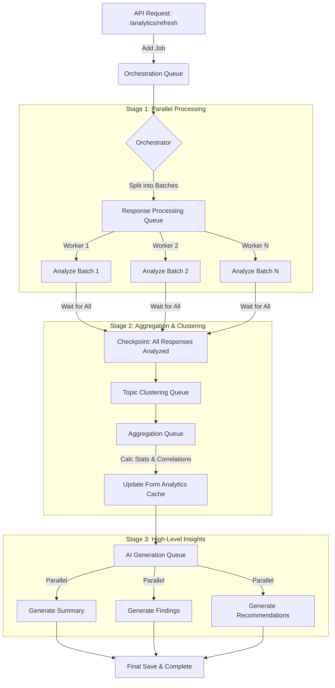

# formul.ai Architecture Overview

This document outlines the technical architecture of **formul.ai**, designed to assist in preparing a technical presentation.

## 1. High-Level Architecture

The system follows a modern **Microservices-lite** architecture using Docker for containerization.

*   **Client (Frontend):** A React Single Page Application (SPA) served via Nginx.
*   **Gateway:** Nginx acts as a reverse proxy, routing traffic to the frontend and backend API.
*   **Backend (API):** A monolithic NestJS application handling business logic, AI orchestration, and data management.
*   **Database:** MongoDB (v7.0) for flexible, schema-less data storage (ideal for dynamic forms).
*   **Queue/Cache:** Redis (v7) used for background job queues (Bull) and caching.
*   **AI Layer:** Integrates with OpenAI and Ollama via LangChain for LLM capabilities.

## 2. Backend Architecture (Server)

The backend is built with **NestJS**, a progressive Node.js framework, ensuring modularity and scalability.

### Key Modules
*   **App Module:** The root module orchestrating all others.
*   **Auth Module:** Handles authentication using `Passport` (JWT & Local strategies) and `Bcrypt` for security.
*   **Forms Module:** The core business domain. Manages form creation, updates, and retrieval.
*   **AI Module:** Encapsulates all LLM interactions (see section 3).
*   **Analytics Module:** Handles data aggregation and complex analysis of form responses.
*   **Worker Module:** A dedicated entry point (`worker.ts`) for processing background jobs, ensuring heavy AI tasks don't block the main API.

### Key Technologies
*   **Framework:** NestJS v11
*   **ODM:** Mongoose (MongoDB)
*   **Queues:** Bull (Redis-based) for asynchronous task processing.
*   **Validation:** `class-validator` and `class-transformer`.
*   **Documentation:** Swagger (OpenAPI).

## 3. AI Integration ("The Brain")

The `AiService` is the central intelligence unit, leveraging **LangChain** to abstract model interactions.

### Capabilities
1.  **Multi-Provider Support:** Seamlessly switches between **OpenAI** (Cloud) and **Ollama** (Local LLM) based on environment configuration.
2.  **Generative Form Creation:**
    *   **Standard Generation:** Creates forms from simple text prompts.
    *   **Chain-of-Thought Generation (`generateWithSteps`):** Uses a streaming, multi-step process:
        1.  **Analyze:** Deconstructs the user's request and defines a strategy.
        2.  **Draft:** Generates a list of potential questions.
        3.  **Optimize:** Refines question types and UX (e.g., converting text questions to multiple choice where appropriate).
        4.  **Finalize:** Constructs the final JSON form structure.
3.  **Batch Analysis:** Processes multiple text inputs in parallel with concurrency control and automatic retries, essential for analyzing large volumes of form responses.
4.  **Structured Output:** Enforces strict JSON schemas on LLM outputs to ensure system stability.

## 4. Data & Analytics Engine

The data model is designed for depth and performance, specifically in the `Form` schema.

### Smart Caching
The `Form` document includes a sophisticated `analytics` field that acts as a persistent cache. This avoids re-calculating expensive AI insights on every read.

### Analytics Capabilities (Stored in `Form.analytics`)
*   **Topic Analysis:**
    *   Identifies dominant, emerging, and saturated topics.
    *   Tracks topic trends over time.
    *   Detects "Counter-Narratives" (minority viewpoints).
*   **Sentiment Analysis:**
    *   Granular sentiment breakdown (Overall, By Question, By Topic).
    *   Emotional Tone detection (e.g., "Frustrated", "Hopeful").
    *   Correlation between topics and sentiment.
*   **Correlation Engine:**
    *   **Question-to-Question:** Statistical correlations between answers.
    *   **Topic-to-Rating:** How specific topics influence numerical ratings.
    *   **Sentiment-to-Choice:** How sentiment correlates with multiple-choice selections.
*   **Narrative Insights:**
    *   Auto-generated "Key Findings" and "Recommendations" with confidence scores.
    *   Identification of "Deviant Cases" (outliers) and "Anomalies".
*   **Quote Extraction:** Automatically curates "Representative", "High Quality", and "Deviant" quotes to support findings.

## 5. Frontend Architecture (Client)

A modern, responsive interface built for speed and interactivity.

*   **Framework:** **React 19** with **Vite** (fast build tool).
*   **Language:** TypeScript.
*   **Styling:** **Tailwind CSS** for utility-first styling.
*   **State Management:** `react-hook-form` for complex form handling.
*   **Interactivity:** `react-dnd` for Drag-and-Drop form building.
*   **Routing:** `react-router-dom`.
*   **HTTP Client:** `Axios`.

## 6. Infrastructure & DevOps

*   **Docker Compose:** Orchestrates the entire stack (DB, Redis, Backend, Frontend, Mailhog).
*   **Mailhog:** Captures emails locally for testing without sending real spam.
*   **Environment Config:** Strict separation of secrets (`.env`) and public config.

## 7. Worker & Process Architecture

The system uses a **distributed worker pattern** to handle heavy computational tasks (specifically AI analytics) without blocking the main API.

### Process Separation
*   **Main API (`main.ts`):** Handles HTTP requests, authentication, and lightweight CRUD operations.
*   **Worker (`worker.ts`):** A standalone NestJS application context that connects to Redis and processes background jobs. It does *not* listen on an HTTP port.

### Job Queues (Bull / Redis)
The system uses **Bull** (Redis-based queue) to manage asynchronous workflows. The `AnalyticsQueueModule` defines the following queues:

1.  **Orchestration Queue:** The "manager" that coordinates the entire analytics pipeline.
2.  **Response Processing Queue:** Handles AI analysis of individual form responses (batched).
3.  **Topic Clustering Queue:** Canonicalizes and groups similar topics across responses.
4.  **Aggregation Queue:** Calculates statistics, correlations, and sentiment distributions.
5.  **AI Generation Queue:** Generates high-level insights (summaries, findings, recommendations) using GPT-4.

### Analytics Workflow (The "Orchestrator" Pattern)
The `OrchestrationConsumer` manages the lifecycle of an analytics task to ensure data consistency and fault tolerance.

### Key Worker Features
*   **Batch Processing:** Responses are processed in chunks (e.g., 10 at a time) to maximize throughput while respecting rate limits.
*   **Progress Tracking:** The orchestrator publishes real-time progress updates (0-100%) to a Redis key, which the frontend polls.
*   **Dead Letter Queues (DLQ):** Failed jobs are automatically retried. If they fail repeatedly, they are moved to a "Dead Letter" queue for manual inspection.
*   **Concurrency Control:** Different queues have different concurrency settings (e.g., Aggregation is limited to avoid race conditions, while Response Processing is highly parallel).
